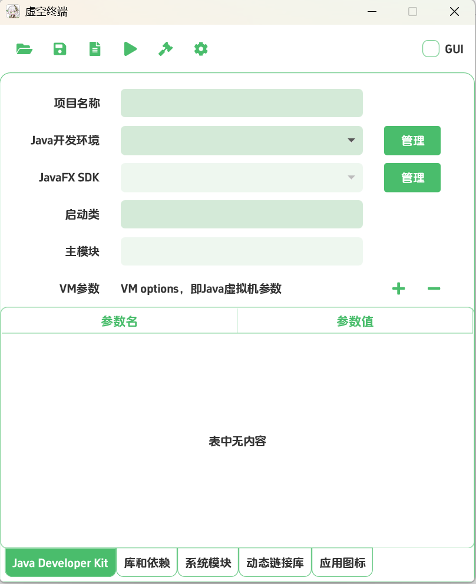

# Java Packager

这是一个Java打包工具，可以方便的打包Java应用为特定平台的应用程序形式：

## Windows
将会打包为一个包含特定可执行文件的目录，主要结构是这样的：

```
app-name.exe      - Launcher executable
package.json      - Application metadata
libs              - Dependency jars
runtime           - java runtime
other files       - Application resources
```

## Linux
将会打包为一个包含特定可执行文件的目录，主要结构是这样的：

```
app-name          - Launcher executable
package.json      - Application metadata
libs              - Dependency jars
runtime           - java runtime
shortcuts         - Desktop shortcuts script(lua)
other files       - Application resources
```

## MacOS
尚未实现。

- - -

## 使用

你可以在Release找到本应用的发布版本，解压到合适的位置并启动Akashic.exe。



从上到下，分别是工具栏，以及详细配置内容，选项卡的按钮从左到右有以下的功能：


- 打开：选择一个打包配置文件
- 保存：保存当前的配置到一个打包工作目录
  - 你需要把项目保存到一个单独的文件夹中，因为稍后会在项目文件所在的目录中生成图标集和打包的结果（位于dist目录）
- 新建：新建一个打包配置
- 测试：依据打包配置尝试启动Java应用，但不实际打包
  - 你需要指定测试运行的时候使用的目录，该目录被视为应用程序的安装目录（working dir）
- 构建：依据打包配置打包Java应用
- 配置：本软件的语言和UI设置
- GUI选项：打包为GUI还是控制台应用，勾选的时候不显示控制台窗口。

